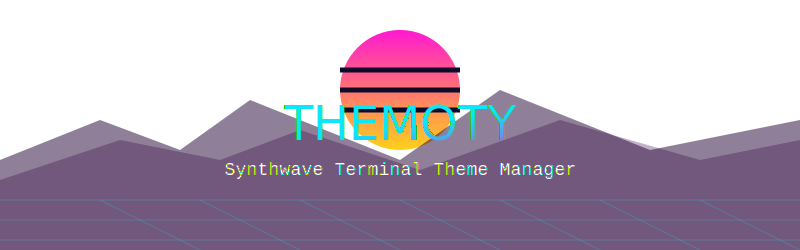

# Themoty - Terminal Theme Manager



Themoty is a comprehensive CLI/TUI tool for managing terminal themes using the iTerm2-Color-Schemes collection. It provides a simple, intuitive interface to apply, preview, and manage terminal color schemes.

## 🌟 Features

- **Synthwave-inspired TUI** for a delightful user experience
- **Support for 25+ terminal emulators** including Alacritty, Kitty, Foot, WezTerm, and many more
- **Theme preview** before applying
- **Search and filter** themes by name or category
- **Manage favorites** for quick access to your preferred themes
- **Export/import theme settings** between machines
- **Automatic theme categorization** (dark, light, vibrant, pastel)
- **Random theme application** for discovery
- **Configuration backup and restore**

## 📋 Requirements

- Bash 4.0+
- Git (for installation and updates)
- Curl (for downloading dependencies)
- Optional but recommended:
  - [gum](https://github.com/charmbracelet/gum) (for enhanced TUI)
  - [glow](https://github.com/charmbracelet/glow) (for markdown rendering)

## 🚀 Installation

### Quick Install

```bash
git clone https://github.com/eraxe/themoty.git
cd themoty
./themoty.sh install
```

Themoty will automatically install itself and download the iTerm2-Color-Schemes repository.

### Manual Installation

1. Clone the repository:
   ```bash
   git clone https://github.com/eraxe/themoty.git
   ```

2. Make the script executable:
   ```bash
   chmod +x themoty.sh
   ```

3. Link or copy the script to your PATH:
   ```bash
   sudo ln -s "$(pwd)/themoty.sh" /usr/local/bin/themoty
   # OR for user-only installation
   mkdir -p ~/.local/bin
   ln -s "$(pwd)/themoty.sh" ~/.local/bin/themoty
   ```

## 🎮 Usage

### TUI Mode

Simply run `themoty` without arguments to launch the interactive TUI:

```bash
themoty
```

### Command-line Options

```bash
themoty install   # Install Themoty system-wide
themoty update    # Update Themoty and theme collection
themoty remove    # Uninstall Themoty
themoty help      # Show help information
```

## 🎨 Supported Terminals

- alacritty
- foot
- ghostty
- gnome-terminal
- kitty
- konsole
- lxterminal
- rio
- terminator
- termite
- termux
- tilix
- vscode (integrated terminal)
- wezterm
- xfce4-terminal
- xresources
- pantheonterminal
- hexchat
- putty
- wayst
- royalts
- tilda
- electerm
- termframe
- mobaxterm
- remmina

## 📝 Configuration

Themoty stores its configuration in `~/.config/themoty/`:

- `config`: General configuration
- `preferences`: Last used terminal and theme
- `favorites`: Your favorite themes
- `theme_export.json`: Exported theme settings

## ⚙️ Customization

To add support for additional terminals, edit the `TERMINAL_CONFIGS` array in the script.

## 🤝 Contributing

Contributions are welcome! Feel free to submit issues or pull requests.

## 📜 License

MIT License

## 🙏 Credits

- [iTerm2-Color-Schemes](https://github.com/mbadolato/iTerm2-Color-Schemes) for the amazing collection of terminal themes
- [Charm](https://charm.sh/) for the TUI libraries (gum and glow)

## 👤 Author

**Arash Abolhasani** - [@eraxe](https://github.com/eraxe)
